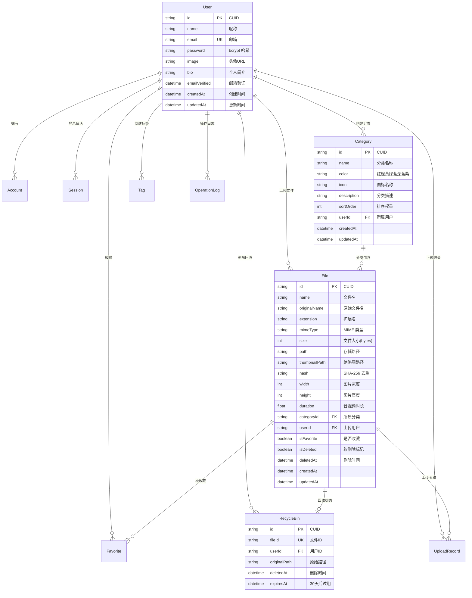

# 🗂️ 收纳盒 (Rainbow-box) `v1.1.01`

> 现代化个人文件管理与分类收纳平台 —— 以黑白灰阶分类重新定义文件管理方式，让每一份文件都有它的归属。

<p align="center">
  
  
  
  
  
  
</p>

---

## 📖 项目简介

**收纳盒 (Rainbow-box)** 是一个基于 Next.js 的现代化个人文件管理与分类收纳平台。它采用"白、浅灰、中灰、灰、深灰、墨、黑"七级黑白灰阶作为分类体系，以 Notion 风格统一后台界面，让文件管理变得直观、优雅且高效。支持拖拽上传、在线预览、智能搜索、收藏、回收站等丰富的功能，并提供每日待办、随手记、音乐盒、日历与计时器等效率面板，以及暗黑/明亮双主题切换。

当前版本 **v1.1.01** 完成了整体视觉升级：首页与分类管理界面改为黑白单色天体蓝图科技风格（SVG 轨道曲线 + 十字定位 + 月球纹理，替代 Three.js 粒子系统）；侧边栏支持拖拽调宽；随时记写新增全屏工作台模式；全部 localStorage 持久化按账号隔离。

---

## ✨ 项目功能

### 🎨 核心功能

| 功能 | 说明 |
|------|------|
| **拖拽上传** | 支持拖拽、点击、批量上传多种方式，大文件分块上传与断点续传，实时进度反馈，失败自动重试 |
| **黑白分类** | 白、浅灰、中灰、灰、深灰、墨、黑七级灰阶分类，统一视觉规范，让文件管理清晰直观 |
| **在线预览** | 图片、视频、音频、PDF、Office 文档、Markdown 等常见格式无需下载，直接在线预览 |
| **智能搜索** | 按文件名关键词快速检索，支持按分类、文件类型、日期范围多维筛选，分页懒加载流畅不卡顿 |
| **收藏 & 最近** | 一键收藏常用文件，自动记录最近访问与最近修改，高频文件触手可及 |
| **回收站** | 删除文件进入回收站，30 天内可随时恢复，到期自动物理清理 |
| **标签系统** | 自定义标签及颜色，灵活标记与快速筛选文件 |

### 🔐 账户与安全

- 邮箱注册与登录，密码采用 **bcrypt (12 轮加盐)** 哈希存储
- **Session 认证**机制，使用 httpOnly Cookie，7 天有效期
- **路由中间件**拦截未登录请求，自动跳转登录页并保留原始目标
- 安全响应头（X-Frame-Options: DENY、X-Content-Type-Options: nosniff、X-XSS-Protection 等）
- **操作日志**完整记录（上传、下载、删除、恢复、重命名、移动等）
- **SHA-256 文件哈希**，自动检测重复文件

### 🎭 用户体验

- **天体蓝图首页**：Hero 区域用 SVG 轨道曲线 + 十字定位标识 + 月球灰度纹理替代 Three.js 粒子系统，黑白单色科技蓝图风格
- **蓝图分类页**：分类管理界面为天体轨道曲线背景 + 坐标十字定位点 + 月球灰度肌理 + 蓝图草稿质感 + 透明渐变分类卡片
- **Notion 风格后台**：导航居中、侧边栏、卡片、弹窗统一黑白灰阶设计，多层阴影营造立体感
- **可调侧边栏**：支持左右拖动调整宽度（200–480px），右侧面板可切换
- **效率面板**：左侧每日待办、随手记、音乐盒（本地音乐上传播放）；右侧日历与计时器；随手记支持展开到工作台的全屏模式（75vh 模态框）
- **账号数据隔离**：待办、随手记、壁纸等全部 localStorage 持久化按账号隔离，切换账号互不干扰
- **暗黑 / 明亮**双主题，可跟随系统或手动切换
- **Framer Motion** 驱动的流畅页面过渡与交互动画
- 响应式自适应布局，桌面端与移动端体验一致

---

## 🛠️ 技术栈

| 类别 | 技术 | 版本 | 说明 |
|------|------|------|------|
| **框架** | [Next.js](https://nextjs.org/) | ^15.1.0 | React 全栈框架，App Router + Server Actions |
| **UI 库** | [React](https://react.dev/) | ^19.0.0 | 用户界面构建 |
| **语言** | [TypeScript](https://www.typescriptlang.org/) | ^5.7.0 | 严格模式，类型安全 |
| **样式** | [Tailwind CSS](https://tailwindcss.com/) | ^3.4.0 | 原子化 CSS + CSS 变量主题 |
| **组件库** | [Radix UI](https://www.radix-ui.com/) | — | 无样式无障碍组件基元 |
| **ORM** | [Prisma](https://www.prisma.io/) | ^6.6.0 | 类型安全的数据访问层 |
| **数据库** | SQLite | — | 轻量级嵌入式数据库 |
| **表单** | [react-hook-form](https://react-hook-form.com/) | ^7.54.0 | 高性能表单管理 |
| **校验** | [Zod](https://zod.dev/) | ^3.24.0 | Schema 声明式数据校验 |
| **动画** | [Framer Motion](https://www.framer.com/motion/) | ^11.18.0 | React 声明式动画库 |
| **状态管理** | [Zustand](https://zustand-demo.pmnd.rs/) | ^5.0.0 | 轻量级全局状态管理 |
| **加密** | [bcryptjs](https://github.com/dcodeIO/bcrypt.js) | ^3.0.3 | 密码加盐哈希 |
| **上传** | [react-dropzone](https://react-dropzone.js.org/) | ^14.3.0 | 拖拽上传 React 组件 |
| **图标** | [Lucide React](https://lucide.dev/) | ^0.468.0 | 开源 SVG 图标库 |
| **主题** | [next-themes](https://github.com/pacocoursey/next-themes) | ^0.4.4 | 主题切换与持久化 |
| **图片处理** | [sharp](https://sharp.pixelplumbing.com/) | ^0.33.5 | 服务端高性能图片处理 |

> 注：v1.1.01 起首页 Hero 不再使用 Three.js，已移除 `three` / `@react-three/fiber` / `@react-three/drei` 依赖，改为纯 SVG 天体蓝图实现。

---

## 📁 项目目录

```
Rainbow-box/
│
├── prisma/                            # 数据库层
│   ├── schema.prisma                  # 数据模型定义（10 张表）
│   ├── seed.ts                        # 种子数据脚本
│   └── prisma/                        # Prisma Client 生成文件
│
├── public/                            # 静态资源
│   ├── images/                        # 公共图片
│   └── uploads/files/                 # 用户文件存储目录（按日期分）
│
├── src/
│   │
│   ├── actions/                       # 🔹 Server Actions（服务端操作）
│   │   ├── auth.ts                    #   登录 / 注册 / 登出
│   │   ├── categories.ts              #   分类 CRUD
│   │   ├── files.ts                   #   文件 CRUD / 搜索 / 移动
│   │   └── profile.ts                 #   用户资料更新
│   │
│   ├── app/                           # 🔹 Next.js App Router
│   │   ├── globals.css                #   全局样式 & CSS 变量（Notion warm neutral）
│   │   ├── layout.tsx                 #   根布局（主题、元数据）
│   │   ├── page.tsx                   #   首页 Landing Page
│   │   │
│   │   ├── (auth)/                    #   认证页面组（无布局共享）
│   │   │   ├── login/page.tsx         #   登录页
│   │   │   └── register/page.tsx      #   注册页
│   │   │
│   │   ├── (dashboard)/               #   仪表盘页面组
│   │   │   ├── categories/            #   黑白灰阶分类管理
│   │   │   ├── favorites/             #   我的收藏
│   │   │   ├── files/                 #   全部文件
│   │   │   ├── recent/                #   最近使用
│   │   │   └── recycle/               #   回收站
│   │   │
│   │   ├── (user)/                    #   用户页面组
│   │   │   └── profile/               #   个人资料设置
│   │   │
│   │   ├── dashboard/                 #   仪表盘页面实现
│   │   │   ├── layout.tsx             #     仪表盘布局外壳
│   │   │   ├── page.tsx               #     仪表盘首页
│   │   │   ├── categories/            #     分类页 & [color] 筛选（天体蓝图）
│   │   │   ├── favorites/page.tsx     #     收藏页
│   │   │   ├── files/page.tsx         #     文件页
│   │   │   ├── recent/page.tsx        #     最近访问页
│   │   │   └── recycle/page.tsx       #     回收站页
│   │   │
│   │   └── api/                       #   API 路由
│   │       ├── auth/                  #     认证接口
│   │       ├── categories/            #     分类接口
│   │       ├── files/                 #     文件接口
│   │       ├── upload/                #     上传接口（含 chunk 分块）
│   │       └── user/                  #     用户接口
│   │
│   ├── components/                    # 🔹 React 组件
│   │   ├── auth/                      #   认证表单组件
│   │   ├── categories/                #   分类组件（模态框等）
│   │   ├── files/                     #   文件组件（预览器、上传区）
│   │   ├── landing/                   #   首页组件
│   │   │   ├── navbar.tsx             #     导航栏（居中 Notion 风格）
│   │   │   ├── hero.tsx               #     SVG 天体蓝图 Hero（轨道曲线 + 十字定位 + 月球纹理）
│   │   │   ├── features-section.tsx   #     功能特性展示（六项精简）
│   │   │   └── footer.tsx             #     页脚
│   │   ├── layout/                    #   布局组件
│   │   │   ├── dashboard-layout.tsx   #     仪表盘布局（可拖拽侧边栏 + 右面板）
│   │   │   ├── notes-modal.tsx        #     随时记写工作台全屏模态框（75vh）
│   │   │   ├── sidebar-todo.tsx       #     每日待办
│   │   │   ├── sidebar-notes.tsx      #     随手记（8 条上限 + 展开）
│   │   │   ├── sidebar-music.tsx      #     音乐盒（本地音乐）
│   │   │   ├── calendar-widget.tsx    #     日历
│   │   │   └── timer-widget.tsx       #     计时器
│   │   └── ui/                        #   通用 UI 组件
│   │       ├── button.tsx             #     按钮
│   │       ├── input.tsx              #     输入框
│   │       ├── dialog.tsx             #     弹窗
│   │       ├── avatar.tsx             #     头像
│   │       ├── label.tsx              #     标签
│   │       ├── theme-provider.tsx     #     主题 Provider
│   │       └── theme-toggle.tsx       #     主题切换按钮
│   │
│   ├── hooks/                         # 🔹 自定义 Hooks
│   │   └── index.ts                   #   通用 Hooks 导出
│   │
│   ├── lib/                           # 🔹 工具库
│   │   ├── api-response.ts            #   API 统一响应封装
│   │   ├── auth.ts                    #   认证逻辑（Session、bcrypt）
│   │   ├── idb.ts                     #   IndexedDB 封装（音乐曲库持久化）
│   │   ├── prisma.ts                  #   Prisma 单例客户端
│   │   ├── security.ts                #   安全工具（限流、哈希）
│   │   ├── utils.ts                   #   通用工具函数（cn、getContrastColor、账号隔离等）
│   │   └── validations.ts             #   Zod Schema 校验定义
│   │
│   ├── services/                      # 🔹 业务服务层
│   ├── store/                         # 🔹 Zustand 全局状态
│   │   ├── index.ts                   #   Store 定义（UI / 文件 / 分类，含 sidebarWidth）
│   │   └── widgets.ts                 #   Widget Store（待办 / 随手记 / 音乐）
│   ├── styles/                        # 🔹 额外样式表
│   └── types/                         # 🔹 TypeScript 类型定义
│       └── index.ts                   #   核心类型 & 接口
│
├── .env                               # 环境变量
├── .env.example                       # 环境变量模板
├── middleware.ts                       # 认证路由守卫
├── next.config.ts                     # Next.js 配置
├── tailwind.config.ts                 # Tailwind 配置
├── tsconfig.json                      # TypeScript 配置
├── postcss.config.mjs                 # PostCSS 配置
└── package.json                       # 项目依赖 & 脚本
```

---

## 🚀 快速开始

### 环境要求

| 工具 | 最低版本 |
|------|----------|
| **Node.js** | >= 18.17 |
| **pnpm**（推荐） | >= 8.0 |
| 或 npm / yarn | — |

### 分步安装

```bash
# 1. 克隆仓库
git clone https://github.com/parandoctor/Box.git rainbow-box
cd rainbow-box

# 2. 安装依赖
pnpm install

# 3. 配置环境变量
cp .env.example .env
# 编辑 .env，按需设置：
#   DATABASE_URL="file:./dev.db"

# 4. 初始化数据库（创建表结构）
pnpm db:push

# 5. （可选）填充示例种子数据
pnpm seed

# 6. 启动开发服务器
pnpm dev
```

浏览器访问 **[http://localhost:3000](http://localhost:3000)** 即可体验。

### 常用命令一览

| 命令 | 说明 |
|------|------|
| `pnpm dev` | 启动开发服务器（热更新） |
| `pnpm build` | 构建生产版本 |
| `pnpm start` | 启动生产服务器 |
| `pnpm lint` | ESLint 代码检查 |
| `pnpm type-check` | TypeScript 类型检查 |
| `pnpm db:push` | 直接推送 Schema 到 SQLite |
| `pnpm db:migrate` | 创建数据库迁移文件 |
| `pnpm db:studio` | 打开 Prisma Studio 可视化管理 |
| `pnpm db:reset` | 重置数据库（删除所有数据） |
| `pnpm seed` | 执行种子数据填充脚本 |

---

## 🗄️ 数据库设计

本项目采用 **SQLite** + **Prisma ORM**，包含 10 张核心数据表，完整的实体关系如下：

### 实体关系图 (ERD)



### 数据模型说明

| 模型 | 记录数 | 核心职责 | 关键约束 |
|------|--------|----------|----------|
| **User** | 用户 | 账户管理与身份标识 | email 唯一 |
| **Account** | OAuth 账户 | 第三方登录凭据（预留） | provider+accountId 唯一 |
| **Session** | 登录会话 | 7 天有效期认证令牌 | userId 索引、expiresAt 索引 |
| **Category** | 分类 | 黑白灰阶分类体系 | name+userId 唯一、sortOrder 索引 |
| **File** | 文件 | 文件元数据与存储映射 | 软删除 + 多维复合索引 |
| **Favorite** | 收藏 | 用户-文件收藏关系 | userId+fileId 唯一 |
| **RecycleBin** | 回收站 | 30 天可恢复的删除记录 | fileId 唯一、expiresAt 索引 |
| **Tag** | 标签 | 用户自定义标记 | name+userId 唯一 |
| **UploadRecord** | 上传记录 | 上传状态追踪 | userId + fileId 复合索引 |
| **OperationLog** | 操作日志 | 全操作审计追踪 | userId 索引 |

---

## 🤝 贡献指南

我们热烈欢迎社区贡献！无论是功能建议、Bug 报告还是代码提交，请遵循以下规范。

### 贡献流程

1. **Fork** 本仓库到你的 GitHub 账户
2. **Clone** 到本地：`git clone https://github.com/YOUR_USERNAME/Box.git`
3. **创建**特性分支：`git checkout -b feature/your-feature-name`
4. **编码**并确保通过类型检查和 Lint
5. **提交**代码：`git commit -m '✨ feat: 添加某某功能'`
6. **推送**分支：`git push origin feature/your-feature-name`
7. **创建 Pull Request** 到 `main` 分支

### Commit 信息规范

本项目采用 [Conventional Commits](https://www.conventionalcommits.org/zh-hans/) 规范：

| 前缀 | 用途 | 示例 |
|------|------|------|
| `✨ feat` | 新功能 | `feat: 添加文件批量下载功能` |
| `🐛 fix` | Bug 修复 | `fix: 修复回收站过期文件未清理的问题` |
| `📝 docs` | 文档变更 | `docs: 更新 API 接口文档` |
| `🎨 style` | 代码格式 | `style: 统一缩进为 2 空格` |
| `♻️ refactor` | 重构 | `refactor: 提取文件上传为独立 Service` |
| `⚡ perf` | 性能优化 | `perf: 文件列表虚拟滚动优化` |
| `✅ test` | 测试 | `test: 添加分类模块单元测试` |
| `🔧 chore` | 构建/工具 | `chore: 升级 Next.js 到 15.1` |

### 代码规范

- 使用 **TypeScript 严格模式**，`noUncheckedIndexedAccess` 已开启
- 运行 `pnpm type-check` 确保零类型错误后再提交
- 运行 `pnpm lint` 确保 ESLint 规则全部通过
- **客户端组件**首行必须添加 `"use client"` 指令
- **Server Actions** 统一放在 `src/actions/` 目录
- API 响应统一使用 `api-response.ts` 工具函数（`successResponse` / `errorResponse`）
- 组件使用 `cn()` 工具函数拼接 Tailwind 类名
- 主题色统一走 CSS 变量（Notion warm neutral 暖中性色系），不要硬编码 hex

### 分支策略

```
main        ← 稳定发布分支（受保护）
  ├── develop              ← 集成分支
  │   ├── feature/xxx      ← 功能开发
  │   └── fix/xxx          ← Bug 修复
  └── hotfix/xxx           ← 紧急修复
```

### Issue 提交

- 🐛 **Bug 报告**：请附上复现步骤、期望行为、实际行为和截图
- 💡 **功能建议**：请描述使用场景、期望效果和实现思路

---

## 📄 License

本项目基于 [MIT License](LICENSE) 开源，欢迎自由使用、修改和分发。

---

<p align="center">
  <sub>Made with ❤️ by Rainbow-box Team · v1.1.01</sub>
</p>
