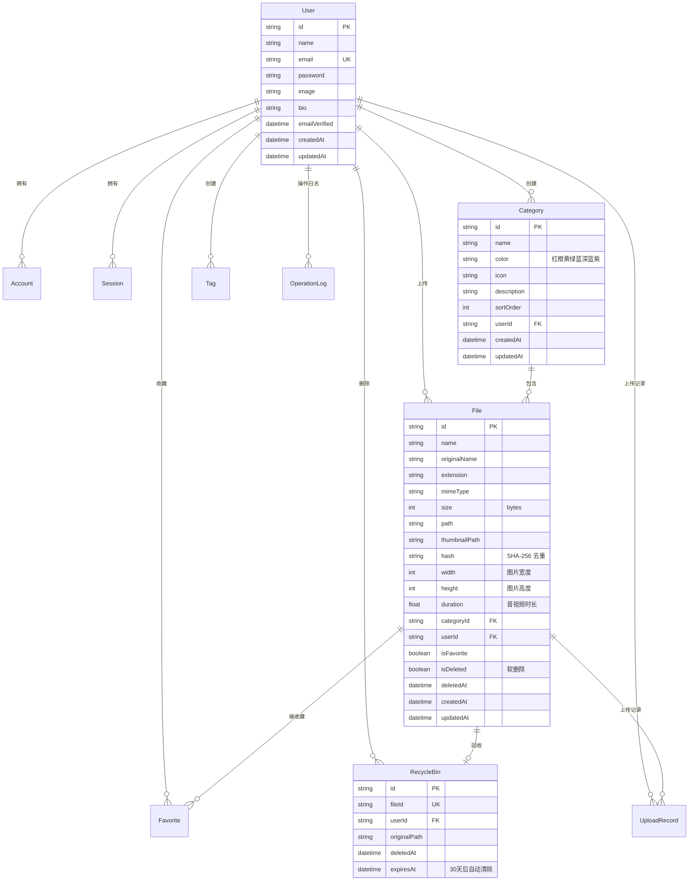

# 🗂️ 收纳盒 (Rainbow-box)

> 现代化个人文件管理与分类收纳平台 —— 以七彩分类重新定义文件管理方式，让每一份文件都有它的归属。

<p align="center">
  
  
  
  
  
  
</p>

---

## 📖 项目简介

**收纳盒 (Rainbow-box)** 是一个基于 Next.js 的现代化个人文件管理与分类收纳平台。它以"红、橙、黄、绿、蓝、深蓝、紫"七种颜色作为分类体系，让文件管理变得直观、优雅且高效。支持拖拽上传、在线预览、智能搜索、收藏、回收站等丰富的功能，并拥有精美的粒子动画首页和暗黑/明亮双主题切换。

---

## ✨ 项目功能

### 🎨 核心功能

| 功能 | 说明 |
|------|------|
| **拖拽上传** | 支持拖拽、点击、批量上传多种方式，大文件断点续传，实时进度显示 |
| **七彩分类** | 红橙黄绿蓝深蓝紫七种配色分类，统一的视觉规范，管理更直观 |
| **在线预览** | 图片、视频、音频、PDF、Office 文档、Markdown 等格式在线预览 |
| **智能搜索** | 按文件名搜索，支持按分类、类型、日期筛选，分页懒加载 |
| **收藏 & 最近** | 收藏常用文件，自动记录最近访问，高频文件触手可及 |
| **回收站** | 删除的文件进入回收站，支持恢复，30 天自动清理 |
| **标签系统** | 自定义标签，灵活标记和筛选文件 |

### 🔐 账户与安全

- 邮箱注册 / 登录，bcrypt 加盐密码哈希
- Session 认证（httpOnly Cookie）
- 路由中间件拦截未登录请求
- 安全响应头（X-Frame-Options、X-XSS-Protection 等）
- 操作日志记录（上传、下载、删除、恢复等）

### 🎭 用户体验

- **Three.js 粒子动画**首页背景，鼠标交互响应
- **暗黑 / 明亮**双主题，跟随系统或手动切换
- **Framer Motion** 流畅的动画与过渡效果
- 响应式设计，适配桌面和移动端

---

## 🛠️ 技术栈

| 类别 | 技术 | 说明 |
|------|------|------|
| **框架** | [Next.js 15](https://nextjs.org/) | React 全栈框架，App Router |
| **UI 库** | [React 19](https://react.dev/) | 用户界面构建 |
| **语言** | [TypeScript](https://www.typescriptlang.org/) | 类型安全 |
| **样式** | [Tailwind CSS](https://tailwindcss.com/) + [Radix UI](https://www.radix-ui.com/) | 原子化 CSS + 无样式组件库 |
| **ORM** | [Prisma](https://www.prisma.io/) | 数据库 ORM |
| **数据库** | SQLite | 轻量级本地数据库 |
| **表单** | [react-hook-form](https://react-hook-form.com/) + [Zod](https://zod.dev/) | 表单管理与校验 |
| **动画** | [Framer Motion](https://www.framer.com/motion/) | React 动画库 |
| **3D** | [Three.js](https://threejs.org/) / [@react-three/fiber](https://docs.pmnd.rs/react-three-fiber) | 首页粒子动画 |
| **状态管理** | [Zustand](https://zustand-demo.pmnd.rs/) | 轻量全局状态 |
| **加密** | [bcryptjs](https://github.com/dcodeIO/bcrypt.js) | 密码哈希 |
| **上传** | [react-dropzone](https://react-dropzone.js.org/) | 拖拽上传组件 |
| **图标** | [Lucide React](https://lucide.dev/) | 开源图标库 |
| **主题** | [next-themes](https://github.com/pacocoursey/next-themes) | 主题切换 |

---

## 📁 项目目录

```
Rainbow-box/
├── prisma/                        # 数据库配置
│   ├── schema.prisma              # 数据模型定义
│   ├── seed.ts                    # 种子数据
│   └── prisma/                    # Prisma 生成文件
├── public/
│   ├── images/                    # 静态图片资源
│   └── uploads/files/             # 用户上传文件存储
├── src/
│   ├── actions/                   # Server Actions
│   │   ├── auth.ts                # 认证相关操作
│   │   ├── categories.ts          # 分类相关操作
│   │   ├── files.ts               # 文件相关操作
│   │   └── profile.ts             # 用户资料操作
│   ├── app/
│   │   ├── globals.css            # 全局样式
│   │   ├── layout.tsx             # 根布局
│   │   ├── page.tsx               # 首页（Landing）
│   │   ├── (auth)/                # 认证页面组
│   │   │   ├── login/page.tsx     # 登录
│   │   │   └── register/page.tsx  # 注册
│   │   ├── (dashboard)/           # 仪表盘页面组
│   │   │   ├── categories/        # 分类管理
│   │   │   ├── favorites/         # 收藏文件
│   │   │   ├── files/             # 全部文件
│   │   │   ├── recent/            # 最近使用
│   │   │   └── recycle/           # 回收站
│   │   ├── (user)/                # 用户页面组
│   │   │   └── profile/           # 个人资料
│   │   ├── dashboard/             # 仪表盘页面实现
│   │   └── api/                   # API 路由
│   │       ├── auth/              # 认证接口
│   │       ├── categories/        # 分类接口
│   │       ├── files/             # 文件接口
│   │       ├── upload/            # 上传接口（含分块）
│   │       └── user/              # 用户接口
│   ├── components/                # React 组件
│   │   ├── auth/                  # 认证表单组件
│   │   ├── categories/            # 分类组件（模态框等）
│   │   ├── files/                 # 文件组件（预览、上传区）
│   │   ├── landing/               # 首页组件（导航、Hero、特性）
│   │   ├── layout/                # 布局组件（仪表盘外壳）
│   │   └── ui/                    # 通用 UI 组件（按钮、输入框等）
│   ├── hooks/                     # 自定义 Hooks
│   ├── lib/                       # 工具库
│   │   ├── api-response.ts        # API 响应工具
│   │   ├── auth.ts                # 认证逻辑
│   │   ├── prisma.ts              # Prisma 客户端
│   │   ├── security.ts            # 安全工具
│   │   ├── utils.ts               # 通用工具函数
│   │   └── validations.ts         # Zod 校验模式
│   ├── services/                  # 业务逻辑服务层
│   ├── store/                     # Zustand 状态管理
│   ├── styles/                    # 额外样式
│   └── types/                     # TypeScript 类型定义
├── .env                           # 环境变量
├── next.config.ts                 # Next.js 配置
├── tailwind.config.ts             # Tailwind CSS 配置
├── tsconfig.json                  # TypeScript 配置
└── package.json                   # 项目依赖
```

---

## 🚀 快速开始

### 环境要求

- **Node.js** >= 18.17
- **pnpm** / npm / yarn（推荐 pnpm）

### 安装与运行

```bash
# 1. 克隆项目
git clone https://github.com/parandoctor/Box.git rainbow-box
cd rainbow-box

# 2. 安装依赖
pnpm install

# 3. 配置环境变量
cp .env.example .env
# 编辑 .env 文件，设置 DATABASE_URL 等

# 4. 初始化数据库
pnpm db:push

# 5. （可选）填充种子数据
pnpm seed

# 6. 启动开发服务器
pnpm dev
```

打开 [http://localhost:3000](http://localhost:3000) 即可访问。

### 常用命令

| 命令 | 说明 |
|------|------|
| `pnpm dev` | 启动开发服务器 |
| `pnpm build` | 构建生产版本 |
| `pnpm start` | 启动生产服务器 |
| `pnpm lint` | 代码检查 |
| `pnpm type-check` | TypeScript 类型检查 |
| `pnpm db:push` | 推送 Schema 到数据库 |
| `pnpm db:migrate` | 创建数据库迁移 |
| `pnpm db:studio` | 打开 Prisma Studio |
| `pnpm db:reset` | 重置数据库 |
| `pnpm seed` | 运行种子数据脚本 |

---

## 🗄️ 数据库设计

本项目使用 **SQLite** 搭配 **Prisma ORM**，以下是核心数据模型：

### ER 图



### 核心模型说明

| 模型 | 说明 | 关键特性 |
|------|------|----------|
| **User** | 用户账户 | 支持邮箱注册，预留 OAuth 扩展 |
| **Category** | 七彩分类 | 名称+用户唯一约束，支持排序 |
| **File** | 文件记录 | 软删除、SHA-256 哈希去重、缩略图 |
| **Favorite** | 收藏夹 | 用户+文件唯一约束 |
| **RecycleBin** | 回收站 | 30 天过期自动清理 |
| **Tag** | 标签 | 自定义颜色，用户范围内唯一 |
| **UploadRecord** | 上传记录 | 跟踪上传状态（完成/处理中/错误） |
| **OperationLog** | 操作日志 | 审计用户所有操作行为 |
| **Session** | 会话管理 | 7 天有效期，httpOnly Cookie |
| **Account** | 第三方账户 | 预留给未来 OAuth 集成 |

---

## 🤝 贡献指南

我们欢迎任何形式的贡献！请遵循以下流程：

### 贡献流程

1. **Fork** 本仓库
2. **创建**特性分支：`git checkout -b feature/amazing-feature`
3. **提交**更改：`git commit -m '✨ feat: add amazing feature'`
4. **推送**到分支：`git push origin feature/amazing-feature`
5. **创建** Pull Request

### Commit 规范

本项目推荐使用 [Conventional Commits](https://www.conventionalcommits.org/) 规范：

| 类型 | 说明 |
|------|------|
| `✨ feat` | 新功能 |
| `🐛 fix` | 修复 Bug |
| `📝 docs` | 文档更新 |
| `🎨 style` | 代码格式（不影响功能） |
| `♻️ refactor` | 代码重构 |
| `⚡ perf` | 性能优化 |
| `✅ test` | 测试相关 |
| `🔧 chore` | 构建/工具配置变更 |

### 代码规范

- 使用 **TypeScript** 严格模式（`strict: true`）
- 使用 **ESLint** 保持代码风格一致
- 提交前运行 `pnpm type-check` 确保类型无误
- 客户端组件使用 `"use client"` 指令
- Server Actions 放在 `src/actions/` 目录
- API 路由统一使用 `api-response.ts` 工具函数

### 分支策略

- `main` —— 稳定发布分支
- `develop` —— 开发分支
- `feature/*` —— 功能开发分支
- `fix/*` —— Bug 修复分支

---

## 📄 License

本项目采用 [MIT License](LICENSE) 开源协议。

---

<p align="center">
  <sub>Made with ❤️ by Rainbow-box Team</sub>
</p>
